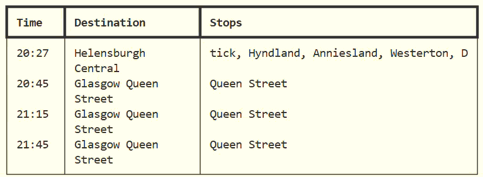

# Train Tracker

Web scraper for live UK rail data with basic command line rail board.

### Setup
- Using Python 3.13 install requirements. 
- To select station, change `STATION_CODE` value in `src/config/py` to the appropriate three letter code: https://www.nationalrail.co.uk/stations/
- Run `src/train_tracker.py` to generate file of departures.
- `outputs/<STATION_CODE>_departures.csv` contains details of all departures from that station.
- To select platform for display, edit `PLATFORM NUMBER` in `src/config.py`
- Then run `src/dotMatrix.py`

